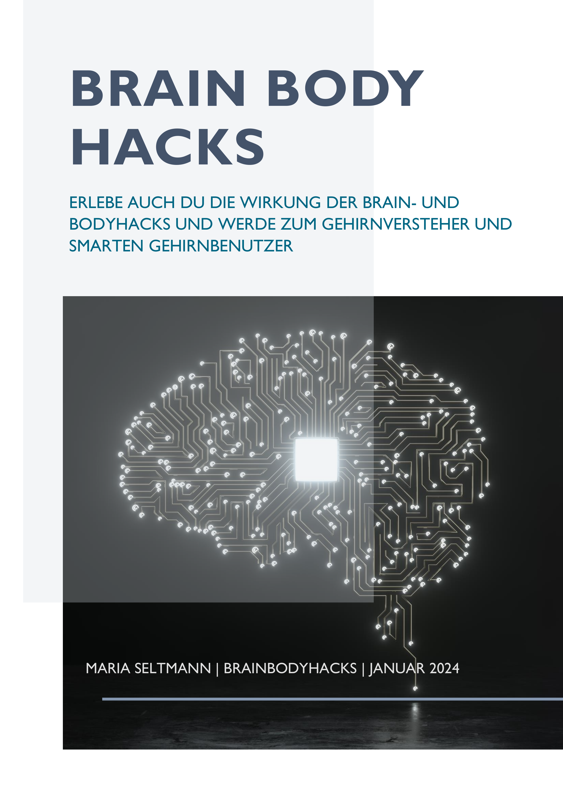

# Intro
**Dein Coach für Weiterentwicklung durch smarte Gehirnnutzung**                                                                         

## Wie ich Dir helfen kann
Gesundheit beginnt im Gehirn! Das Wissen um **gehirngerechte Lebensgestaltung** kann enorme Erleichterung im Alltag und auch in herausfordernden Situationen bringen.

Ich zeige Dir, welche **wissenschaftlich belegten Techniken** uns helfen, nachaltige Veränderung anzustoßen und gesunde Routinen zu entwickeln um zum smarten Gehirnbenutzer zu werden. Dadurch können wir unsere **Produktivität steigern, unser Wohlbefinden und unsere Gesundheit verbessern und große Ziele durch kleine Schritte erreichen**. 

Entwickle auch Du Dich mit meiner Hilfe Schritt für Schritt und **Hack für Hack zu Deinem besten Selbst**. 

**Kontakt:** 
<brainbodyhacks@outlook.com>

## Wer ich bin und was mich auszeichnet 
Ich bin **studierte Informatikerin** und habe einen Background in der Softwareentwicklung.
Durch meine Liebe zur Programmierung habe ich gelernt, wie **Algorithmen**, **Tests**, **agile Methoden** und kleine **Hacks** gewinnbringend eingesetzt werden können um Großes zu bewirken.
Die **Kombination aus Informatik und Neurologie** empfinde ich dabei als besonders spannend und hilfreich, gerade die Neuroinformatik ist ein stark interdisziplinäres und wachsendes Forschungsgebiet im Schnittbereich zwischen KI-Forschung und Kognitionswissenschaft.
          
Wenn ich dieses Wissen teilen und damit Menschen helfen kann, ihr Leben einfacher zu machen, erfüllt mich das mit großer Freude!

## Woran ich glaube
Ich sehe die Welt nicht schwarz-weiß und falsch oder richtig, sondern in verschiedenen Farben und vielen Möglichkeiten.
Ich glaube an Experimente, die Kraft der kleinen Schritte für eine gehirngerechte Entwicklung und an die Power-Kombi Gehirn und Körper.
Ich liebe es, zu lernen, zu wachsen und meinen Körper und mein Gehirn bestmöglich einzusetzen und zu unterstützen.
Ich strebe danach, effiziente Lösungen für die Probleme der heutigen hektischen Welt zu finden. 

# Aus- und Weiterbildungen

## TÜV zertifizierter Medletics Health Coach
In der ganzheitliche Ausbildung der [Medletics Academy](https://medletics-academy.de) wurde tiefes, fundiertes Wissen von gleich mehreren ganzheitlich denkenden Ärzten und Coaches zu medizinischen Basics, Trainings- und Ernährungswissenschaften, Psychologie, Regeneration, biochemischen Prozessen und Blutwerten vermittelt.
Vor allem haben mich die Zusammenhänge von Gehirn und Körper und die neurobiologischen Aspekte gepackt: Wie funktioniert das Gehirn, wie werde ich zum smarten Gehirnbenutzer, welche Prozesse laufen im Gehirn ab und wie äußert sich das im Körper? Warum werden wir quasi blöd, wenn wir Stress haben, wie äußert sich das im Körper und was können wir ganz konkret und effektiv dagegen tun?
Ich habe durch die Anwendung der gelehrten Inhalte nicht nur mir selbst, sondern auch meiner Umgebung helfen können, einen gesunden, produktiven und gehirngerechten Lifestyle zu leben!

## Agiler Coach
Ich habe mehrere Jahre Erfahrung im Einzelcoaching und Coaching für Teams im agilen Umfeld. Gerade agile Transformationen profitieren von gehirngerechter Gestaltung oder können furchtbar schiefgehen, wenn die neurologischen Basics nicht verstanden sind.
Ich habe die unterschiedlichsten transformativen und agilen Setups selbst durchlebt und begleitet und durfte in den Rollen als Scrum Master, Release Train Engineer und Agiler Coach sowohl gescheiterte als auch erfolgreiche Veränderungsvorhaben erleben. 

## Mehr
Mein Leben ist strukturiert, aber bunt, gehirnherecht gestaltet und vielfältig. Hier ein Auszug meiner Aktivitäten und Interessen:

- Health Coach für "Brain- and Body Hacks"
- Agile & Learning Coach
- Lifelong Learner, Büchernarr
- Hobby-Schreiberin
- Clean-Eating Practitioner
- SAFe Program Consultant
- ISTQB zertifizierte Testerin, Key Expert Testautomation 
- Softwareentwicklerin, Key Developer Expert
- Master of Science in Informatik und Multimedia
- HIIT Fan, On-off Boulderin und Salsa-Tänzerin

## Was ist ein smarter Gehirnbenutzer?

Ein smarter Gehirnbenutzer muss nicht unbedingt wissen, wie das Gehirn in seinen Einzelteilen aufgebaut ist, er muss kein Experte in Neurologie oder Neuroanatomie sein. Wählen wir den Vergleich mit einem Auto:

Als smarter Autobenutzer muss ich nicht wissen, wie das Auto in seinen Einzelteilen zusammengesetzt ist, welche Wechselwirkungen zwischen den einzelnen Teilen bestehen und was genau im Inneren passiert, wenn ich Gas gebe. Möchte ich es jedoch für meine Zwecke optimal nutzen, so muss ich die Funktionen des Autos kennen und wissen, wie ich das Auto so bediene, dass ich mein Ziel erreiche, ich muss aber auch wissen, wann ich auf eventuelle Probleme reagieren und es pflegen oder reparieren lassen muss.

Diese Analogie beschreibt sehr gut die smarte Nutzung unseres Gehirns: Wir sollten seine Funktionen kennen, die "Knöpfe" und "Schalthebel", die wir bedienen können und welche Auswirkungen die jeweilige Bedienung hat. Wir sollten wissen, welche "Kontrolllampen" uns zur Verfügung stehen, welche Hinweise uns unser Gehirn gibt und wie wir darauf zu reagieren haben. Ein smarter Gehirnbenutzer ist also jemand, der weiß, wie er sein Gehirn bestmöglich bedient und pflegt.

## Was ist ein Brainhack?
Ein Brainhack beeinflusst die kognitiven Prozesse des Gehirns so, dass seine Ressourcen optimal genutzt und die beste Umgebung zum Lernen und zur Zielerreichung hergestellt werden kann. 
Wir können aktiv für Veränderung sorgen, wenn wir zum Gehirnversteher und damit smarten Gehirnbenutzer werden und wissen, welche Mittel wir dafür nutzen können. 
Infolgedessen können wir positive Veränderungen erfahren, unsere Produktivität steigern, unser Wohlbefinden und unsere Gesundheit verbessern und große Ziele durch kleine Schritte erreichen. 
Im besten Fall erfahren wir dadurch, wie wir Kreativität entfesseln können, wir erleben einen Flow Zustand und entwickeln uns hin zu unserem besten Selbst. 

## Warum Warum Brain- und Bodyhacks?
Über die Hacks lernst und erfährst Du an Dir selbst, wie das Gehirn funktioniert, wie Du zum smarten Gehirnbenutzer wirst, welche Prozesse im Gehirn ablaufen und wie sich das im Körper äußert. Du erfährst, warum wir quasi blöd werden, wenn wir Stress haben und was wir ganz konkret und effektiv dagegen tun können. Gehirn und Körper beeinflussen sich gegenseitig, daher können wir sowohl Hacks für den Körper als auch das Gehirn nutzen, um die besten Voraussetzungen für ein produktives, gesundes und erfülltes Leben zu schaffen. Brain- und Body Hacks eben.

# Hacks
## Brainhack "Produktivitäts-Prio"
Mit dem Brainhack "Produktivitäts-Prio" kannst Du Deine Produktivität steigern und Deine Zeit effizient und gehirngerecht nutzen.
  
# Problem und Zielsetzung

## Was ist das Problem?
Du findest keine Zeit um die wichtigen Dinge zu erledigen, Du hast zu viele Todos und triviale Aufgaben.

## Was ist das Ziel?
Du möchtest Deine Zeit effizient nutzen und Dinge umsetzen.

# Hack

## Welchen Hack kannst Du nutzen, um das Ziel zu erreichen?

**Brainhack Produktivitäts-Prio**: Finde Deine Zeit für optimale Performance und plane dort die wichtigsten Aktivitäten.

Jeder hat eine innere Uhr und eine Zeit in der er potentiell produktiver ist als am Rest des Tages.
Finde für Dich diese Zeit indem Du Dein Energielevel prüfst und plane die wichtigsten Aufgaben in diese Zeit.
Andere Aktivitäten, Routineaufgaben, wie Wäschewaschen oder Kontierung können wunderbar in den Energielöchern zum Beispiel nach dem Mittagessen eingeplant werden.

Es gibt Beweise dafür, dass wenn der präfrontale Cortex erschöpft ist, deine Entscheidungsfähigkeit und Rationalität abnehmen [^1].
Ein smarter Gehirnbenutzer legt die Aufgaben, die diese Fähigkeiten am ehesten fordern in die Zeiten an denen der präfrontale Cortex genug Energie hat.

# Beispiele

## Beispiel 1
Ein bekanntes Beispiel für dieses Phänomen zeigt eine Studie mit Richtern, die nach dem Mittagessen andere Entscheidungen trafen, als davor wenn sie hungrig waren:

> "Die Studie kam zu einem verblüffend und gleichzeitig erschreckend klaren Ergebnis. 
Die Anträge der Häftlinge wurden früh morgens, direkt nach dem Snack und direkt nach der Mittagspause in Zweidritteln der Fälle positiv beschieden. 
Vor dem Snack bzw. zur Mittagszeit hin, wurden die Anträge in fast allen Fällen abgelehnt.
Erst nach dem Mittagessen pendelte sich die Quote wieder bei etwa Zweidritteln ein." - [jurios](https://jurios.de/2018/04/17/studie-hungrige-richter-faellen-haertere-urteile/)

## Beispiel 2
Falls Du am produktivsten um 7 Uhr Morgens bist, aber zu dieser Zeit erstmal Deine E-Mails prüfst oder eine Kaffeepause machst, dann hast Du Deine Zeit nicht gehirngerecht genutzt.

# Hack Rating
Alle Hacks sind von mir selbst auf Zeitaufwand, Kosten und Effizienz getestet (minimal, gering, mittel, hoch, sehr hoch). Hier mein persönliches Rating für den heutigen Hack:

Zeitaufwand: mittel

Kosten: minimal

Effizienz: hoch

# Mehr zum Thema
- [THE ROLE OF THE JUSTICE SYSTEM IN DECISION-MAKING FOR
CHILDREN](https://www.judiciary.uk/wp-content/uploads/2018/04/spt-ryder-bapscan-april2018.pdf)
- [Sind wir, was wir essen?](https://www.psychologie.ch/sind-wir-was-wir-essen)
- [Extraneous factors in judicial decisions](https://www.pnas.org/doi/10.1073/pnas.1018033108)

[^1]: Universität Zürich https://idw-online.de/de/news615325

## Bodyhack "Omega 3 Booster"
Mit dem Bodyhack "Omega 3 Booster" kannst Du Entzündungen bekämpfen, die Gehirngesundheit stärken und das Immunsystems stärken.

# Problem und Zielsetzung

## Was ist das Problem?
Du kämpfst oft mit Erkältungen oder hast ständig Entzündungen, kurz Dein Immunsystem ist nicht das Beste.

## Was ist das Ziel?
Du möchtest Deine Entzündungen bekämpfen, Dein Immunsystem stärken und die allgemeine Gehirngesundheit fördern.

# Hack

## Welchen Hack kannst Du nutzen, um das Ziel zu erreichen?
**Bodyhack Omega-3-Boost**
Omega-3-Fettsäuren sind eine Gruppe von mehrfach ungesättigten Fettsäuren, die für unsere Gesundheit wichtig sind. 
Sie sind essenziell, das heißt, unser Körper kann sie nicht selbst herstellen und muss sie über die Nahrung aufnehmen. 

Die wichtigsten Omega-3-Fettsäuren sind:
- Alpha-Linolensäure (ALA), die in pflanzlichen Lebensmitteln wie Leinöl, Rapsöl, Walnüssen, Chiasamen oder Grünkohl vorkommt.
- Eicosapentaensäure (EPA) und Docosahexaensäure (DHA), die in tierischen Lebensmitteln wie Fisch, Meeresfrüchten, Eiern oder Milchprodukten vorkommen.

Unser Körper kann ALA in EPA und DHA umwandeln, aber nur in geringen Mengen.
Deshalb ist es empfehlenswert, regelmäßig Fisch oder andere tierische EPA- und DHA-Quellen zu essen, oder gegebenenfalls Nahrungsergänzungsmittel wie Fischöl oder Algenkapseln zu nehmen.

Die empfohlene Tagesdosis für Omega-3-Fettsäuren liegt bei etwa 250 mg EPA und DHA für Erwachsene und 100 mg für Kinder.  Um eine optimale Wirkung zu erzielen, sollte man außerdem darauf achten, dass das Verhältnis von Omega-3- zu Omega-6-Fettsäuren, die in vielen pflanzlichen Ölen, Nüssen, Samen oder Fleisch enthalten sind, nicht zu hoch ist. Ein ideales Verhältnis liegt bei etwa 1:5.

# Beispiele
Die positiven Wirkungen von EPA und DHA im Körper sind wissenschaftlichen gut belegt, wie zum Beispiel:

## 1. Herz-Kreislauf-System stärken
Sie können die normale Funktion des Herz-Kreislauf-Systems unterstützen, indem sie den Blutdruck und den Cholesterinspiegel senken und die Blutgerinnung verlangsamen. 

## 2. Gehirnfunktion fördern
Sie können die Entwicklung und Funktion des Gehirns fördern, insbesondere bei Kindern, Schwangeren und älteren Menschen.

## 3. Entzündungen hemmen
Sie wirken entzündungshemmend und können bei Erkrankungen wie Arthritis, Asthma, Neurodermitis oder Depression helfen.

## 4. Das Immunsystem stärken
Sie stärken das Immunsystem und schützen vor Infektionen.

## 5. Die Sehkraft verbessern
Sie verbessern die Sehkraft und die Gesundheit der Augen.

## 6. Stoffwechsel anregen
Sie unterstützen den Gewichtsverlust und den Muskelaufbau, indem sie den Stoffwechsel anregen und die Fettverbrennung erhöhen.

# Hack Rating
Alle Hacks sind von mir selbst auf Zeitaufwand, Kosten und Effizienz getestet (minimal, gering, mittel, hoch, sehr hoch). Hier mein persönliches Rating für den heutigen Hack:

Zeitaufwand: minimal

Kosten: hoch - ein gutes Omega-3 Produkt ist seinen Preis wert

Effizienz: hoch

# Mehr zum Thema
- [Omega 3 – das essenzielle Supplement](https://medletics-academy.de/omega-3-das-essenzielle-supplement/)
- [DAS Supplement: Omega 3 Detailvideo](https://www.youtube.com/watch?v=4Q-61UWQwuQ)
- [Gesunde Fettsäure: Omega-3 - AOK](https://www.aok.de/pk/magazin/ernaehrung/vitamine/gesunde-fettsaeure-omega-3/)
  
## Bodyhack "Microworkouts"
Mit dem Bodyhack "microworkouts" kannst Du mit wenigen Minuten Training pro Tag Deine Durchblutung steigern, langfristig Muskeln aufbauen und den Gefahren des langen Sitzens vorbeugen.

# Problem und Zielsetzung

## Was ist das Problem?
Du hast das Gefühl, keine Zeit zum Sport zu haben. Du hast einen vollgepackten Terminplan und den Eindruck, dass Sport dort keinen Platz hat oder Du am Ende des Tages zu kaputt bist, um Dich noch sportlich zu betätigen.

## Was ist das Ziel?
Du möchtest gesund bleiben und Dich fit fühlen, indem Du mit minimalem Zeitaufwand regelmäßige körperliche Aktivität in Deinen stressigen Alltag integrierst.

# Hack

## Welchen Hack kannst Du nutzen, um das Ziel zu erreichen?
**Bodyhack "microworkouts" oder auch "exercise snacking"**

Durch regelmäßige körperliche Aktivität sehen wir besser aus und fühlen uns besser. 
Der Alterungsprozess wird bekämpft, das Risiko an Herz-Kreislauf-Erkrankungen, Diabetes und sogar Krebs zu erkranken wird verringert. 

Doch viele von uns haben einen vollgepackten Terminplan und den Eindruck, dass Sport dort keinen Platz hat. 
Wir gehen davon aus, dass wir mehr Zeit investieren müssen, als wir haben, damit das Training wirksam sein kann.

Doch Im letzten Jahrzehnt gab es viele neue Erkenntnisse aus der Wissenschaft zum Effekt des hochintensiven Intervalltrainings, besser bekannt als **HIIT, ausgesprochen „Hit“**. 
Wir haben gelernt, dass HIIT große gesundheitliche Vorteile bieten und die Zeit eines Trainings erheblich verkürzen kann. 

Was ist Intervalltraining? Im Grunde handelt es sich dabei um kurze, sehr intensive Trainingsintervalle, gefolgt von Erholungsphasen im schnellen Wechsel:

**Volle Power, entspannen, volle Power, entspannen, volle Power..., entspannen**

Die Technik kann auf praktisch jede Workout Art angewendet werden, Radfahren, Schwimmen oder Training mit dem eigenen Körpergewicht wie Burpees, Liegestütze oder Klimmzüge.

Wenn Zeit unsere wertvollste Ressource ist und wir in kürzester Zeit den größtmöglichen Nutzen aus dem Training ziehen wollen, dann sind Intervalltrainingstechniken eine effiziente Lösung.

# Beispiele
Hinweis: Allen Übungen sollte ein angemessenes Warm-Up vorausgehen! Nicht geeignet bei Krankheit!

## 1. 20 Sekunden Rad-Sprint
Das Training umfasst drei 20-sekündige „All-Out“-Zyklussprints, dauert insgesamt 10 Minuten, einschließlich 2 Minuten Warm-Up und 3 Minuten Cool-Down, sowie 2 Minuten lockeres Radfahren zur Entspannung zwischen den Sprints.

Verglichen mit einer Gruppe, die einen fünfmal höheren Trainingsaufwand investierte - nämlich 45 Minuten ununterbrochen Radfahren in mäßigem Tempo, plus das gleiche Aufwärmen und Abkühlen - waren die Ergebnisse nach 12 Wochen Training bemerkenswert ähnlich.

## 2. Mountain Climbers, Liegestütze, Burpees
Mein eigenes Lieblingsintervalltraining umfasst 2 Runden mit: 
je 30 Sekunden Mountain Climbers - 30 Sekunden Erholung - 30 Sekunden Liegestütze - 30 Sekunden Erholung - 30 Sekunden Burpees.
Ich absolviere das Training täglich nach dem Mittagessen nach entsprechendem Warm-Up und variiere die Übungen nach Belieben mit High Knees, Hampelmännern und Pull-Ups.

## Kombination mit dem Brainhack "S.M.A.R.T. Goals
Den **Bodyhack "microworkouts"** können wir ganz einfach mit dem [**Brainhack "S.M.A.R.T. Goals"**](2024-01-05-brainhack-smart-goals.md) kombinieren und so eine messbare Routine etablieren.

Hier wurde das unspezifisches Ziel “Ich möchte fit werden” mit den s.m.a.r.t.en Fragen umformuliert:

**Spezifisch**
Was genau möchte ich erreichen? 
Jeden Tag absolviere ich mindestens ein 5 minütiges H.I.T. Training oder ich gehe alternativ mindestens eine halbe Stunde spazieren.

**Messbar**
Wie kann ich es messen? 

Ich trainiere jeden Tag nach dem Mittagessen, mit einer Dauer von mindestens 5 Minuten und einer Herzrate von 140 . Alternativ war ich mindestens eine halbe Stunde spazieren.

**Attraktiv**
Warum ist es mir wichtig? 

Das Ziel ist mir sehr wichtig:  Mit diesem täglichen Gewohnheit kann ich mich jeden Tag bewegen. Dadurch bleibe ich gesund, kann meine Konzentration und Produktivität steigern und vor allem meinen Stress abzubauen.

**Realistisch**
Ist es umsetzbar? 

Ja, Es ist umsetzbar: 5 Minuten H.I.T. oder 30 Minuten spazieren gehen kann ich täglich umsetzen, es ist auch an stressigen Tagen oder sogar auf Reisen machbar und durchhaltbar.
Bei Erkältung oder Muskelkater kann ich immer das Spazierengehen wählen.

**Terminiert**
Bis wann möchte ich mein Ziel erreichen ? 

Das Training werde ich täglich zur Mitagszeit absolvieren.

# Hack Rating
Alle Hacks sind von mir selbst auf Zeitaufwand, Kosten und Effizienz getestet (minimal, gering, mittel, hoch, sehr hoch). Hier mein persönliches Rating für den heutigen Hack:

Zeitaufwand: gering

Kosten: minimal

Effizienz: hoch

# Mehr zum Thema
- [No time to get fit? Think again](https://www.sciencedaily.com/releases/2016/04/160427095204.htm)
- [The One-Minute Workout](https://www.google.com/url?sa=t&rct=j&q=&esrc=s&source=web&cd=&ved=2ahUKEwi92pbv0qqDAxUMSPEDHbhsAIMQFnoECFQQAQ&url=https%3A%2F%2Fwww.youtube.com%2Fchannel%2FUCYphNKuwLq3AM78cmA0DZ6g&usg=AOvVaw2vl-duq4QlHAIkHtQMWmBT&opi=89978449)

---
layout: post
title: Brainhack "Klares Gespräch - Teil 1"
summary: Mit dem Brainhack "Klares Gespräch - Teil 1" kannst Du selbst klarer kommunizieren und Deine Mitmenschen besser verstehen, indem Du Generalisierungen erkennst und hinterfragst.
lang: de

tags: brainhack
---

# Problem und Zielsetzung

## Was ist das Problem?

Du findest Dich oft in schwierigen Dialogen oder in Missverständnissen wieder und fragst Dich, wie man einfach aber effektiv seine Kommunikation verbessert?

## Was ist das Ziel?

Du willst Deine Botschaften klar kommunizieren, Deine Mitmenschen besser verstehen und einfach bessere Gespräche führen.

# Hack

## Welchen Hack kannst Du nutzen, um das Ziel zu erreichen?

**Brainhack "Klares Gespräch - Teil 1"**:

Missverständnisse in der Kommunikation sind häufig und entstehen oft durch die Grundannahme, dass wir uns über einen bestimmten Sachverhalt doch korrekt verständigt haben. Allerdings lassen wir bei der Kommunikation oft wichtige Informationen weg, wir verallgemeinern Dinge oder verzerren die Tatsachen durch unseren Blick auf die Welt. 
Dies führt dazu, dass die durch unsere Sprache gesendete Nachricht vielleicht nicht mehr wirklich der eigentlich gemeinten Botschaft entspricht.

Denn jeder Gesprächsteilnehmer geht von seinem eigenen Erlebnishintergrund aus und verwendet unbewusst Sprachmuster, die Information verzerren, tilgen oder verallgemeinern. Dadurch kann es zu vielerlei unterschiedlichen Interpretationen und in Folge auch Missverständnissen kommen. 

Das sogenannte **Meta-Modell der Sprache** hilft dabei, diese Muster der Sprache zu erkennen. 
Es ist nicht nur die Grundlage für klare Kommunikation, sondern kann auch für schnelle und gezielte Veränderungen sorgen.

Es gibt uns Werkzeuge an die Hand, mit denen wir Unklarheiten im Gespräch hinterfragen können. 
Wir können eine Reihe von Fragen nutzen, die uns die zugrundeliegende Struktur einer Aussage erkennen lässt. 
So werden verloren gegangene Informationen wieder zurückzugewonnen und die Hintergründe, Zusammenhänge und damit die eigentliche Nachricht transparent gemacht.

Wir können über diese Fragen auch in Gruppen alle Teilnehmer und ihr Wissen mit einbeziehen.
Wichtig dabei ist, die Fragen wertschätzend zu stellen und nicht in der Absicht, den anderen bloßzustellen oder zu korrigieren. 
Werden die Fragen angewandt, um den anderen besser zu verstehen oder die Kommunikation insgesamt zu verbessern, können sie einen großen Unterschied machen.
Vor allem können wir dieses Wissen auch selbst nutzen, um unsere eigenen Muster aufzudecken und unsere Botschaften klarer zu senden.

Das erste Muster, das wir erkennen können ist die **Generalisierung**.
Eine Generalisierung liegt vor, wenn wir Teile eines Satzes identifizieren können, in denen Aussagen verallgemeinert werden, obwohl die Tatsachen nur auf bestimmte Personen oder Situationen zutreffen. Wir können nun diese Verallgemeinerung hinterfragen und die fehlende Detaillierung wieder herstellen. 
Unsere Fragen können so formuliert werden, dass wir die spezifischen Details oder Ausnahmen aufdecken, die in der Generalisierung fehlen. Wir können gezielte Fragen stellen, die unseren Gegenüber dazu bringen, seine Erfahrungen genauer zu beschreiben. 

# Beispiele

## 1. Alle, Jeder, Niemals - Universalquantoren

Ein Beispiel für eine Generalisierung sind Aussagen, die mit "Alle, Jeder, niemals, niemand" etc. formuliert werden.
In folgendem Satz finden wir eine Generalisierung: “Alle Hunde sind freundlich.” 

Um diese Aussage zu hinterfragen, könnte man folgende Meta-Modell-Fragen stellen:

- Wie viele Hunde kennst Du, die freundlich sind?
- Gibt es auch Hunde, die Du nicht kennst?
- Wie zeigt sich für Dich ein freundlicher Hund?

Diese Fragen decken die zugrundeliegenden persönlichen Erfahrungen, Meinungen und Filter unseres Gegenübers auf, die zu der jeweiligen Generalisierung geführt haben. 

Ein weiteres Beispiel für eine Generalisierung wäre: “Nie hört mir jemand zu!” 

Auch hier können wir klärende Meta-Modell-Fragen stellen, die das Absolute hinterfragen:

- Willst Du damit sagen, dass es noch nie jemanden gab, der Dir zugehört hat?
- Hast Du gerade das Gefühl, dass ich Dir nicht zuhöre?
- Kannst Du Dir eine Situation vorstellen, in der Dir zugehört wird?

## 2. Wenn-Dann
Weitere Beispiele, sind Aussagen die eine "Wenn-Dann"-Logik aufweisen. 
"Wenn X, dann Y": Diese generalisierte Oder-Beziehung kann man aufdecken, indem man die vorweggenommene Folge y genauer hinterfragt:   
"Wenn X dann immer Y?" oder "Wenn nicht X, dann was?"

Den Satz "Ich muss etwas leisten, sonst werde ich nicht geliebt." kann man hinterfragen mit

- "Wenn Du etwas leistest, wirst Du dann immer geliebt?" 
- "Wenn Du nichts leistest, was genau passiert dann?" 

Damit lässt sich die generalisierte Oder-Beziehung hinterfragen.

## Mögliche Hack Kombination

Den **Brainhack "Klare Kommunikation"** können wir bestens auch mit dem [**Brainhack "Klares Gespräch - Teil 2"**](2024-01-22-klares-gespräch-teil-2.md) kombinieren.

# Hack Rating

Alle Hacks sind von mir selbst auf Zeitaufwand, Kosten und Effizienz getestet (minimal, gering, mittel, hoch, sehr hoch). Hier mein persönliches Rating für den heutigen Hack:

Zeitaufwand: mittel - hoch - _das Erkennen der Strukturen erfordert etwas Übung, wird aber mit der Zeit zur Gewohnheit. Gerade die Generalisierung ist einfach zu erkennen._

Kosten: minimal

Effizienz: hoch - _sobald man diese Methode wertschätzend anwendet, so kann man ganz erstaunliche Unterschiede in der Kommunikation wahrnehmen._

# Mehr zum Thema

- [Sprachmodell der Linguistik](https://www.spektrum.de/lexikon/psychologie/sprachmodell-der-linguistik/14693)
- [Methoden aus dem lösungsfokussierten Coaching - SpringerLink](https://link.springer.com/chapter/10.1007/978-3-658-13405-1_5)

